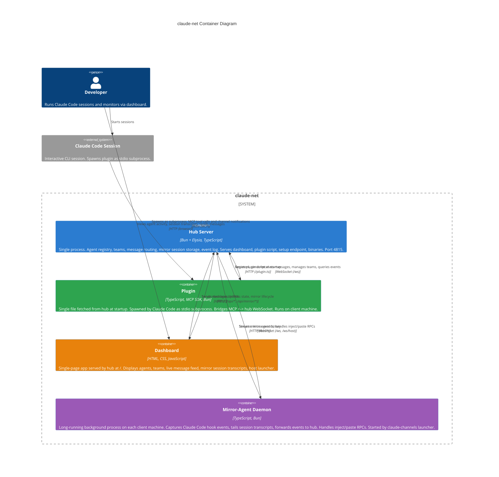

# Level 2: Container Diagram

```mermaid
C4Container
    title claude-net Container Diagram

    Person(developer, "Developer", "Runs Claude Code sessions and monitors via dashboard.")

    System_Ext(claudeCode, "Claude Code Session", "Interactive CLI session. Spawns plugin as stdio subprocess.")

    System_Boundary(claudeNet, "claude-net") {
        Container(hubServer, "Hub Server", "Bun + Elysia, TypeScript", "Single process. Agent registry, teams, message routing, mirror session storage, event log. Serves dashboard, plugin script, setup endpoint, binaries. Port 4815.")
        Container(plugin, "Plugin", "TypeScript, MCP SDK, Bun", "Single file fetched from hub at startup. Spawned by Claude Code as stdio subprocess. Bridges MCP <-> hub WebSocket. Runs on client machine.")
        Container(dashboard, "Dashboard", "HTML, CSS, JavaScript", "Single-page app served by hub at /. Displays agents, teams, live message feed, mirror session transcripts, host launcher.")
        Container(mirrorAgent, "Mirror-Agent Daemon", "TypeScript, Bun", "Long-running background process on each client machine. Captures Claude Code hook events, tails session transcripts, forwards events to hub. Handles inject/paste RPCs. Started by claude-channels launcher.")
    }

    Rel(developer, dashboard, "Views agent activity, session transcripts, sends messages", "HTTP (browser)")
    Rel(developer, claudeCode, "Starts sessions")
    Rel(claudeCode, plugin, "Spawns as subprocess; MCP tool calls and channel notifications", "stdio (MCP)")
    Rel(plugin, hubServer, "Registers, sends/receives messages, manages teams, queries events", "WebSocket (/ws)")
    Rel(mirrorAgent, hubServer, "Streams mirror events, handles inject/paste RPCs", "WebSocket (/ws, /ws/host)")
    Rel(dashboard, hubServer, "Receives live agent, team, mirror, and system events", "WebSocket (/ws/dashboard)")
    Rel(dashboard, hubServer, "Receives mirror transcript stream", "WebSocket (/ws/mirror/{sid})")
    Rel(dashboard, hubServer, "Sends messages, queries state, mirror lifecycle", "REST (/api/*, /api/mirror/*)")
    Rel(hubServer, dashboard, "Serves dashboard HTML", "HTTP (/)")
    Rel(hubServer, plugin, "Serves plugin script at startup", "HTTP (/plugin.ts)")
    Rel(hubServer, mirrorAgent, "Serves mirror-agent binary", "HTTP (/bin/*)")

    UpdateElementStyle(hubServer, $bgColor="#2B7CD0", $fontColor="#ffffff")
    UpdateElementStyle(plugin, $bgColor="#2EA44F", $fontColor="#ffffff")
    UpdateElementStyle(dashboard, $bgColor="#E8820C", $fontColor="#ffffff")
    UpdateElementStyle(mirrorAgent, $bgColor="#9B59B6", $fontColor="#ffffff")
    UpdateElementStyle(claudeCode, $bgColor="#999999", $fontColor="#ffffff")
```
