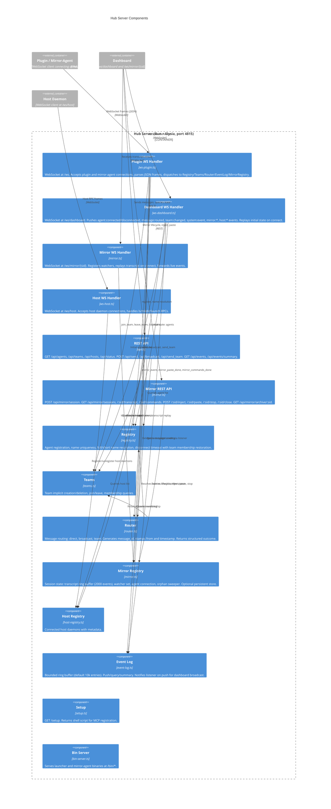

# Level 3: Hub Server Component Diagram

```mermaid
C4Component
    title Hub Server Components

    Container_Ext(plugin, "Plugin / Mirror-Agent", "WebSocket client connecting at /ws")
    Container_Ext(dashboard, "Dashboard", "WebSocket client at /ws/dashboard and /ws/mirror/{sid}, REST client at /api/*")
    Container_Ext(hostDaemon, "Host Daemon", "WebSocket client at /ws/host")

    Container_Boundary(hubServer, "Hub Server (Bun + Elysia, port 4815)") {
        Component(pluginWs, "Plugin WS Handler", "ws-plugin.ts", "WebSocket at /ws. Accepts plugin and mirror-agent connections, parses JSON frames, dispatches to Registry/Teams/Router/EventLog/MirrorRegistry.")
        Component(dashboardWs, "Dashboard WS Handler", "ws-dashboard.ts", "WebSocket at /ws/dashboard. Pushes agent:connected/disconnected, message:routed, team:changed, system:event, mirror:*, host:* events. Replays initial state on connect.")
        Component(mirrorWs, "Mirror WS Handler", "mirror.ts", "WebSocket at /ws/mirror/{sid}. Registers watchers, replays transcript on connect, forwards live events.")
        Component(hostWs, "Host WS Handler", "ws-host.ts", "WebSocket at /ws/host. Accepts host daemon connections, handles ls/mkdir/launch RPCs.")
        Component(restApi, "REST API", "api.ts", "GET /api/agents, /api/teams, /api/hosts, /api/status. POST /api/send, /api/broadcast, /api/send_team. GET /api/events, /api/events/summary.")
        Component(mirrorApi, "Mirror REST API", "mirror.ts", "POST /api/mirror/session. GET /api/mirror/sessions, /:sid/transcript, /:sid/commands. POST /:sid/inject, /:sid/paste, /:sid/stop, /:sid/close. GET /api/mirror/archive/:sid.")
        Component(registry, "Registry", "registry.ts", "Agent registration, name uniqueness, full/short name resolution, disconnect timeout with team membership restoration.")
        Component(teams, "Teams", "teams.ts", "Team implicit creation/deletion, join/leave, membership queries.")
        Component(router, "Router", "router.ts", "Message routing: direct, broadcast, team. Generates message_id, stamps from and timestamp. Returns structured outcome.")
        Component(mirrorRegistry, "Mirror Registry", "mirror.ts", "Session state: transcript ring buffer (2000 events), watcher set, agent connection, orphan sweeper. Optional persistent store.")
        Component(hostRegistry, "Host Registry", "host-registry.ts", "Connected host daemons with metadata.")
        Component(eventLog, "Event Log", "event-log.ts", "Bounded ring buffer (default 10k entries). Push/query/summary. Notifies listener on push for dashboard broadcast.")
        Component(setup, "Setup", "setup.ts", "GET /setup. Returns shell script for MCP registration.")
        Component(binServer, "Bin Server", "bin-server.ts", "Serves launcher and mirror-agent binaries at /bin/*.")
    }

    Rel(plugin, pluginWs, "WebSocket frames (JSON)", "WebSocket")
    Rel(hostDaemon, hostWs, "Host RPC frames", "WebSocket")
    Rel(dashboard, dashboardWs, "Receives live events", "WebSocket")
    Rel(dashboard, mirrorWs, "Receives transcript stream", "WebSocket")
    Rel(dashboard, restApi, "Sends messages, queries state", "REST")
    Rel(dashboard, mirrorApi, "Mirror lifecycle, inject, paste", "REST")

    Rel(pluginWs, registry, "register, name resolution")
    Rel(pluginWs, teams, "join_team, leave_team, list_teams")
    Rel(pluginWs, router, "send, broadcast, send_team")
    Rel(pluginWs, eventLog, "push events")
    Rel(pluginWs, mirrorRegistry, "mirror_event, mirror_paste_done, mirror_commands_done")

    Rel(router, registry, "Resolves names, checks online status")
    Rel(router, teams, "Resolves team membership")

    Rel(restApi, router, "Delegates message sending")
    Rel(restApi, registry, "Queries agent list")
    Rel(restApi, teams, "Queries team list")
    Rel(restApi, hostRegistry, "Queries host list")
    Rel(restApi, eventLog, "Queries event log")

    Rel(mirrorApi, mirrorRegistry, "Session lifecycle, inject, paste, stop")

    Rel(dashboardWs, registry, "Initial state: agents")
    Rel(dashboardWs, teams, "Initial state: teams")
    Rel(dashboardWs, hostRegistry, "Initial state: hosts")
    Rel(dashboardWs, eventLog, "Receives system:event via listener")

    Rel(mirrorWs, mirrorRegistry, "Watcher registration, transcript replay")
    Rel(hostWs, hostRegistry, "Register/unregister host daemons")

    UpdateElementStyle(pluginWs, $bgColor="#4A90D9", $fontColor="#ffffff")
    UpdateElementStyle(dashboardWs, $bgColor="#4A90D9", $fontColor="#ffffff")
    UpdateElementStyle(mirrorWs, $bgColor="#4A90D9", $fontColor="#ffffff")
    UpdateElementStyle(hostWs, $bgColor="#4A90D9", $fontColor="#ffffff")
    UpdateElementStyle(restApi, $bgColor="#4A90D9", $fontColor="#ffffff")
    UpdateElementStyle(mirrorApi, $bgColor="#4A90D9", $fontColor="#ffffff")
    UpdateElementStyle(registry, $bgColor="#4A90D9", $fontColor="#ffffff")
    UpdateElementStyle(teams, $bgColor="#4A90D9", $fontColor="#ffffff")
    UpdateElementStyle(router, $bgColor="#4A90D9", $fontColor="#ffffff")
    UpdateElementStyle(mirrorRegistry, $bgColor="#4A90D9", $fontColor="#ffffff")
    UpdateElementStyle(hostRegistry, $bgColor="#4A90D9", $fontColor="#ffffff")
    UpdateElementStyle(eventLog, $bgColor="#4A90D9", $fontColor="#ffffff")
    UpdateElementStyle(setup, $bgColor="#4A90D9", $fontColor="#ffffff")
    UpdateElementStyle(binServer, $bgColor="#4A90D9", $fontColor="#ffffff")
```
